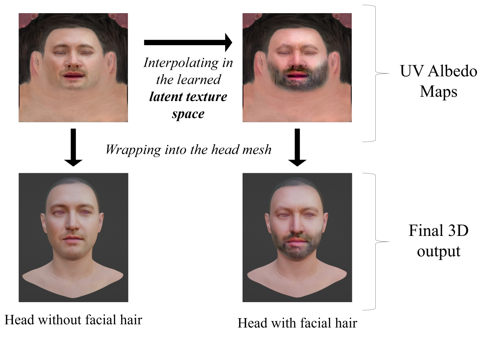

# SemUV: Deep Learning based semantic manipulation over UV texture map of avatar heads.

📄 **Paper:** [arXiv:2407.00229](https://arxiv.org/abs/2407.00229)  
🗓️ **Venue:** 9th International Conference on Computer Vision & Image Processing (CVIP) 2024  
🏆 **Award:** [IAPR Best Student Paper Award](https://cvip2024.iiitdm.ac.in/awards)

**Authors:**  
Anirban Mukherjee, Venkat Suprabath Bitra, Vignesh Bondugula, Tarun Reddy Tallapureddy, Dinesh Babu Jayagopi

---

## 🧠 Overview

**SemUV** introduces a simple and effective framework for **semantic manipulation in the UV texture space** of virtual human heads using deep generative models. Unlike prior works that focus primarily on 2D face images, SemUV operates directly within the **UV texture map** — a crucial component in 3D graphics pipelines — making it better suited for applications in AR/VR, gaming, virtual humans, and VFX.

Our approach offers:

- Semantic edits on UV texture space (e.g., age, gender, facial hair)
- Identity preservation during manipulation
- Independence from structure, lighting, and rendering
- Seamless integration into existing 3D graphics pipelines

<p align="center"> 

</p>

---

## 🧰 Methodology

SemUV builds on publicly available datasets and open-source generative modeling tools. You can understand and replicate the core pipeline by referring to the following components used in our research:

### 📦 Dataset

We use the **[FFHQ-UV dataset](https://github.com/csbhr/FFHQ-UV)**, which provides UV texture maps derived from the FFHQ dataset, enabling high-quality 3D-aware face editing.

- GitHub: [csbhr/FFHQ-UV](https://github.com/csbhr/FFHQ-UV)

### 🧠 Generative Model

We leverage **StyleGAN**-based latent space manipulation using **[InterfaceGAN](https://github.com/genforce/interfacegan)**.

- GitHub: [genforce/interfacegan](https://github.com/genforce/interfacegan)
- Key idea: Learn hyperplanes in latent space to steer semantic attributes such as age, gender, facial hair, etc.

---

## 📚 How It Works

In SemUV, we:

1. Train a StyleGAN model on the FFHQ-UV dataset to generate UV texture maps.
2. Use InterfaceGAN to discover semantic directions in the latent space.
3. Interpolate along these directions to perform attribute manipulation.
4. Maintain identity and visual consistency in the UV space — ideal for downstream 3D rendering.

---

## 🧪 Applications

- Virtual Human Creation
- Game Design
- Augmented & Virtual Reality
- Digital Avatars
- Privacy-preserving 3D Face Editing

---

## 📬 Contact

For any queries or collaborations, feel free to reach out:  
📧 [anirban.mukherjee@iiitb.ac.in]

---

## 📝 Citation

```
@article{mukherjee2024semuv,
  title={SemUV: Deep Learning based semantic manipulation over UV texture map of virtual human heads},
  author={Mukherjee, Anirban and Bitra, Venkat Suprabath and Bondugula, Vignesh and Tallapureddy, Tarun Reddy and Jayagopi, Dinesh Babu},
  journal={arXiv preprint arXiv:2407.00229},
  year={2024}
}

```

---

## Acknowledgements

This project was funded by the [**MINRO Center at IIIT Bangalore**](https://www.iiitb.ac.in/machine-intelligence-robotics-coe-minro).

This work makes use of the following open-source resources:

- [FFHQ-UV Dataset](https://github.com/csbhr/FFHQ-UV)
- [InterfaceGAN](https://github.com/genforce/interfacegan)

We thank the creators for making their tools publicly available.
